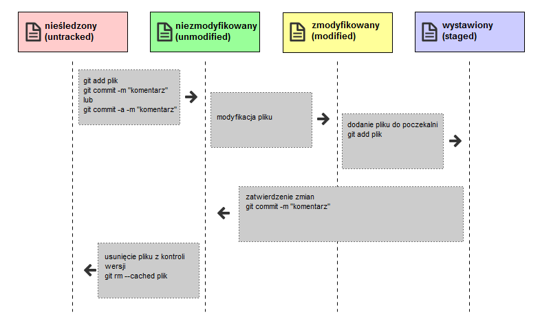

## Git status

Rejestrowanie zmian w repozytorium

Wewnątrz  katalogu ~/demo pojawił się nowy plik **index.html**

`cd ~/demo`{{execute}}

Zobaczmy co jest w środku:

`ls -la`{{execute}}

Zacznijmy od garści teorii.

Posiadasz już repozytorium Gita i ostatnią wersję lub kopię roboczą wybranego projektu. Za każdym razem, kiedy po naniesieniu zmian projekt osiągnie stan, który chcesz zapamiętać, musisz nowe wersje plików zatwierdzić w swoim repozytorium.

Pamiętaj, że każdy plik w twoim katalogu roboczym może być w jednym z dwóch stanów: **śledzony** lub **nieśledzony**. Śledzone pliki to te, które znalazły się w ostatniej migawce; mogą być niezmodyfikowane, zmodyfikowane lub oczekiwać w poczekalni. Nieśledzone pliki to cała reszta — są to jakiekolwiek pliki w twoim katalogu roboczym, które nie znalazły się w ostatniej migawce i nie znajdują się w poczekalni, gotowe do zatwierdzenia. Początkowo, kiedy klonujesz repozytorium, wszystkie twoje pliki będą śledzone i niezmodyfikowane, ponieważ dopiero co zostały wybrane i nie zmieniałeś jeszcze niczego.

Kiedy zmieniasz pliki, Git rozpoznaje je jako zmodyfikowane, ponieważ różnią się od ostatniej zatwierdzonej zmiany. Zmodyfikowane pliki umieszczasz w poczekalni, a następnie zatwierdzasz oczekujące tam zmiany i tak powtarza się cały cykl.

Sprawdzanie stanu twoich plików

Podstawowe narzędzie używane do sprawdzenia stanu plików to polecenie **git status**. Jeśli uruchomisz je bezpośrednio po sklonowaniu lub utworzeniu repozytorium, zobaczysz wynik podobny do poniższego:

`git status`{{execute}}

Powiedzmy, że dodajesz do repozytorium nowy, prosty plik **index.html**. Jeżeli nie istniał on wcześniej, po uruchomieniu git status zobaczysz go jako plik nieśledzony, jak poniżej:

<pre>
On branch master

Initial commit

Untracked files:
  (use "git add <file>..." to include in what will be committed)

        index.html
</pre>

Widać, że twój nowy plik index.html nie jest jeszcze śledzony, ponieważ znajduje się pod nagłówkiem „Untracked files” (Nieśledzone pliki) w informacji o stanie. Nieśledzony oznacza, że Git widzi plik, którego nie miałeś w poprzedniej migawce (zatwierdzonej kopii); Git nie zacznie umieszczać go w przyszłych migawkach, dopóki sam mu tego nie polecisz. Zachowuje się tak, by uchronić cię od przypadkowego umieszczenia w migawkach wyników działania programu lub innych plików, których nie miałeś zamiaru tam dodawać. W tym przypadku chcesz, aby index.html został uwzględniony, więc zacznijmy go śledzić.

## Git add

Śledzenie nowych plików

Aby rozpocząć śledzenie nowego pliku, użyj polecenia git add. Aby zacząć śledzić plik index.html, możesz wykonać:

`git add index.html`{{execute}}

A następnie

`git status`{{execute}}
<pre>
On branch master

Initial commit

Changes to be committed:
  (use "git rm --cached <file>..." to unstage)

        new file:   index.html
</pre>

Widać, że jest w poczekalni, ponieważ znajduje się pod nagłówkiem „Changes to be commited“ (Zmiany do zatwierdzenia). Jeśli zatwierdzisz zmiany w tym momencie, jako migawka w historii zostanie zapisana wersja pliku z momentu wydania polecenia git add. Być może pamiętasz, że po uruchomieniu git init wydałeś polecenie git add (pliki) — miało to na celu rozpoczęcie ich śledzenia. Polecenie git add bierze jako parametr ścieżkę do pliku lub katalogu; jeśli jest to katalog, polecenie dodaje wszystkie pliki z tego katalogu i podkatalogów.

## Git Commit

Przed pierwszym zatwierdzeniem zmiany należy pamietać o ustawieniu w konfiguracji

Nazwy użytkownika: 
`git config --global user.name "It's me" `{{execute}}

Adresu email:
`git config --global user.email "itsme@example.com"`{{execute}}

Zatwierdzanie zmian

Teraz, kiedy twoja poczekalnia zawiera dokładnie to, co powinna, możesz zatwierdzić swoje zmiany. Pamiętaj, że wszystko czego nie ma jeszcze w poczekalni — każdy plik, który utworzyłeś lub zmodyfikowałeś, a na którym później nie uruchomiłeś polecenia git add — nie zostanie uwzględnione wśród zatwierdzanych zmian. Pozostanie wyłącznie w postaci zmodyfikowanych plików na twoim dysku.

W tym wypadku, kiedy ostatnio uruchamiałeś git status, zobaczyłeś, że wszystkie twoje zmiany są już w poczekalni, więc jesteś gotowy do ich zatwierdzenia. Najprostszy sposób zatwierdzenia zmian to wpisanie git commit:

`git commit`{{copy}}

Zostanie uruchomiony wybrany przez ciebie edytor tekstu. (Wybiera się go za pośrednictwem zmiennej środowiskową $EDITOR — zazwyczaj jest to vim lub emacs, możesz jednak wybrać własną aplikację używając polecenia git config --global core.editor

Zatwierdzamy zmiany z poczekalni

`git commit -m "adding index.html" `{{execute}}
<pre>
 1 file changed, 0 insertions(+), 0 deletions(-)
 create mode 100644 index.html
</pre>

Co widać w poleceniu git status ?
`git status`{{execute}}

<pre>
On branch master
nothing to commit, working directory clean
</pre>

## Git Ignore

Ignorowanie plików

Często spotkasz się z klasą plików, w przypadku których nie chcesz, by Git automatycznie dodawał je do repozytorium, czy nawet pokazywał je jako nieśledzone. Są to ogólnie pliki generowane automatycznie, takie jak dzienniki zdarzeń, czy pliki tworzone w czasie budowania projektu. W takich wypadkach tworzysz plik zawierający listę wzorców do nich pasujących i nazywasz go .gitignore. Poniżej znajdziesz przykładowy plik .gitignore:

$ cat .gitignore
*.[oa]
*~

Pierwsza linia mówi Gitowi, by ignorował pliki kończące się na .o lub .a — pliki obiektów i archiwa, które mogą być produktem kompilacji kodu. Druga linia mówi Gitowi, żeby pomijał również wszystkie pliki, które nazwy kończą się tyldą (~), której to używa wiele edytorów tekstu, takich jak Emacs, do oznaczania plików tymczasowych. Możesz też dołączyć katalog log, tmp lub pid, automatycznie wygenerowaną dokumentację itp. Zajęcie się plikiem .gitignore jeszcze przed przystąpieniem do pracy jest zwykle dobrym pomysłem i pozwoli ci uniknąć przypadkowego dodania do repozytorium Git niechcianych plików.

Zasady przetwarzania wyrażeń, które możesz umieścić w pliku .gitignore są następujące:

    Puste linie lub linie rozpoczynające się od # są ignorowane.

    Działają standardowe wyrażenia glob.

    Możesz zakończyć wyrażenie znakiem ukośnika (/) aby sprecyzować, że chodzi o katalog.

    Możesz negować wyrażenia rozpoczynając je wykrzyknikiem (!).

Wyrażenia glob są jak uproszczone wyrażenia regularne, używane przez powłokę. Gwiazdka (*) dopasowuje zero lub więcej znaków; [abc] dopasowuje dowolny znak znajdujący się wewnątrz nawiasu kwadratowego (w tym przypadku a, b lub c); znak zapytania (?) dopasowuje pojedynczy znak; nawias kwadratowy zawierający znaki rozdzielone myślnikiem ([0-9]) dopasowuje dowolny znajdujący się pomiędzy nimi znak (w tym przypadku od 0 do 9).

Możesz użyć dwóch gwiazdek aby dopasować katalogi zagnieżdżone; a/**/z would match a/z, a/b/z, a/b/c/z i tak dalej.

Przykład uzupełnienia pliku .gitignore o pliki  o nazwie *.tmp

Plik powinien być uzupełniony w repozytorium  tak jak zwykłe pliki zawierające nasz kod źródłowy.

Tworzymy nowy plik
`touch .gitignore`{{execute}}

Umieszczamy w nim wyrażanie *.tmp

`echo "*.tmp" >.gitignore`{{execute}}

Sprawdzamy status
`git status `{{execute}}

<pre>
On branch master
Untracked files:
  (use "git add <file>..." to include in what will be committed)

        .gitignore

nothing added to commit but untracked files present (use "git add" to track)
</pre>

Dodajemy do poczekalni plik .gitignore
`git add .gitignore`{{execute}}

`git status `{{execute}}

<pre>
On branch master
Changes to be committed:
  (use "git reset HEAD <file>..." to unstage)

        new file:   .gitignore
</pre>

`git commit -m "adding .gitignore" `{{execute}}

<pre>
 1 file changed, 1 insertion(+)
 create mode 100644 .gitignore
</pre>

`git status `{{execute}}

<pre>
On branch master
nothing to commit, working directory clean
</pre>

Sprawdzmy jak to działa w praktyce

Dodajmy plik z nazwą, która powinna być ignorowana przez repozytorium.

`touch plik1.tmp`{{execute}}

Sprawdzmy czy plik znajduje się w katalogu

`ls -la`{{execute}}

<pre>
drwxr-xr-x 3 root root 4096 Aug  7 16:37 .
drwx------ 5 root root 4096 Aug  7 16:37 ..
drwxr-xr-x 8 root root 4096 Aug  7 16:37 .git
-rw-r--r-- 1 root root    6 Aug  7 16:37 .gitignore
-rw-r--r-- 1 root root   47 Aug  7 16:37 index.html
-rw-r--r-- 1 root root    0 Aug  7 16:37 plik1.tmp
</pre>

Polecenie
`git status`{{execute}}

<pre>
On branch master
nothing to commit, working directory clean
</pre>

nie pokazuje żadnych danych dotyczących nowego pliku.

**Warunkiem ukończenia tej części jest utworzenie i dodanie  do repozytorium git  ~/demo/ lub ~/tutorial/demo/
pliku .gitignore**

