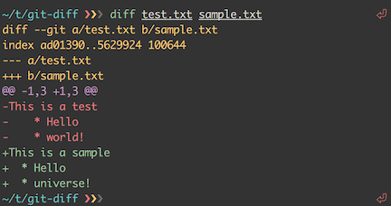

## Git Diff

Podgląd zmian w poczekalni i poza nią

Wewnątrz repozytorium pojawił się nowy plik README i zmodyfikowany index.html

`cd ~/demo`{{execute}}

`ls -la`{{execute}}

Jeśli polecenie **git status** jest dla ciebie zbyt nieprecyzyjne — chcesz wiedzieć, co dokładnie zmieniłeś, nie zaś, które pliki zostały zmienione — możesz użyć polecenia **git diff**. W szczegółach zajmiemy się nim później; prawdopodobnie najczęściej będziesz używał go aby uzyskać odpowiedź na dwa pytania: Co zmieniłeś, ale jeszcze nie trafiło do poczekalni? Oraz, co znajduje się już w poczekalni, a co za chwilę zostanie zatwierdzone? Choć **git status** bardzo ogólnie odpowiada na oba te pytania, **git diff** pokazuje, które dokładnie linie zostały dodane, a które usunięte — w postaci łatki.

Powiedzmy, że  dodałeś do poczekalni plik **README**, a następnie zmodyfikowałeś plik **index.html**, jednak bez umieszczania go wśród oczekujących. Jeśli uruchomisz teraz polecenie status, zobaczysz coś podobnego:

`git status`{{execute}}

<pre>

On branch master
Changes to be committed:
  (use "git reset HEAD <file>..." to unstage)

        new file:   README

Changes not staged for commit:
  (use "git add <file>..." to update what will be committed)
  (use "git checkout -- <file>..." to discard changes in working directory)

        modified:   index.html
</pre>

Aby zobaczyć, co zmieniłeś ale nie wysłałeś do poczekalni, wpisz **git diff** bez żadnych argumentów:

`git diff`{{execute}}

<pre>
diff --git a/index.html b/index.html
index 7a1a5c9..e1e3055 100644
--- a/index.html
+++ b/index.html
@@ -1 +1 @@
-<html><title>Title</title><body></body></html>
+<html><title>Title 2</title><body></body></html>
</pre>

Powyższe polecenie porównuje zawartość katalogu roboczego z tym, co znajduje się w poczekalni. Wynik pokaże ci te zmiany, które nie trafiły jeszcze do poczekalni.

Jeśli chcesz zobaczyć zawartość poczekalni, która trafi do repozytorium z najbliższym zatwierdzeniem, możesz użyć polecenia **git diff --staged**. To polecenie porówna zmiany z poczekalni z ostatnią zmianą:

`git diff --staged`{{execute}}

<pre>
diff --git a/README b/README
new file mode 100644
index 0000000..88fdefe
--- /dev/null
+++ b/README
@@ -0,0 +1 @@
+README VERSION 1
</pre>

Istotnym jest, że samo polecenie git diff nie pokazuje wszystkich zmian dokonanych od ostatniego zatwierdzenia — ­jedynie te, które nie trafiły do poczekalni. Może być to nieco mylące, ponieważ jeżeli wszystkie twoje zmiany są już w poczekalni, wynik git diff będzie pusty.

Jeszcze jeden przykład — jeżeli wyślesz do poczekalni plik index.html, a następnie zmodyfikujesz go ponownie, możesz użyć git status, by obejrzeć zmiany znajdujące się w poczekalni, jak i te poza nią:

`git add index.html`{{execute}}
`echo "<html><title>Title 3</title><body></body></html>" > index.html`{{execute}}

`git status`{{execute}}
<pre>
On branch master
Changes to be committed:
  (use "git reset HEAD <file>..." to unstage)

    modified:   CONTRIBUTING.md

Changes not staged for commit:
  (use "git add <file>..." to update what will be committed)
  (use "git checkout -- <file>..." to discard changes in working directory)

    modified:   CONTRIBUTING.md
</pre>
Teraz możesz użyć **git diff**, by zobaczyć zmiany spoza poczekalni

git diff
diff --git a/CONTRIBUTING.md b/CONTRIBUTING.md
<pre>
index 643e24f..87f08c8 100644
--- a/CONTRIBUTING.md
+++ b/CONTRIBUTING.md
@@ -119,3 +119,4 @@ at the
 ## Starter Projects

 See our [projects list](https://github.com/libgit2/libgit2/blob/development/PROJECTS.md).
+# test line
</pre>
oraz **git diff --cached**, aby zobaczyć zmiany wysłane do poczekalni(--staged i --cached działają identycznie):

`git diff --cached`{{execute}}
<pre>
diff --git a/CONTRIBUTING.md b/CONTRIBUTING.md
index 8ebb991..643e24f 100644
--- a/CONTRIBUTING.md
+++ b/CONTRIBUTING.md
@@ -65,7 +65,8 @@ branch directly, things can get messy.
 Please include a nice description of your changes when you submit your PR;
 if we have to read the whole diff to figure out why you're contributing
 in the first place, you're less likely to get feedback and have your change
-merged in.
+merged in. Also, split your changes into comprehensive chunks if you patch is
+longer than a dozen lines.

 If you are starting to work on a particular area, feel free to submit a PR
 that highlights your work in progress (and note in the PR title that it's
</pre>

## Git Log

Podgląd historii rewizji

Po kilku rewizjach, lub w przypadku sklonowanego repozytorium zawierającego już własną historię, przyjdzie czas, że będziesz chciał spojrzeć w przeszłość i sprawdzić dokonane zmiany. Najprostszym, a zarazem najsilniejszym, służącym do tego narzędziem jest git log.

Poniższe przykłady operują bardzo prostym, demonstracyjnym projekcie o nazwie “simplegit”. Aby go pobrać uruchom:

`git clone https://github.com/schacon/simplegit-progit ~/simplegit-progit`{{execute}}

Przechodzimy do katalogu z projektem

`cd ~/simplegit-progit`{{execute}}

Jeśli teraz uruchomisz na sklonowanym repozytorium polecenie **git log**, uzyskasz mniej więcej coś takiego:

`git log`{{execute}}

<pre>
commit ca82a6dff817ec66f44342007202690a93763949
Author: Scott Chacon <schacon@gee-mail.com>
Date:   Mon Mar 17 21:52:11 2008 -0700

    changed the version number

commit 085bb3bcb608e1e8451d4b2432f8ecbe6306e7e7
Author: Scott Chacon <schacon@gee-mail.com>
Date:   Sat Mar 15 16:40:33 2008 -0700

    removed unnecessary test

commit a11bef06a3f659402fe7563abf99ad00de2209e6
Author: Scott Chacon <schacon@gee-mail.com>
Date:   Sat Mar 15 10:31:28 2008 -0700

    first commit
</pre>

Domyślnie, polecenie git log uruchomione bez argumentów, listuje zmiany zatwierdzone w tym repozytorium w odwrotnej kolejności chronologicznej, czyli pokazując najnowsze zmiany w pierwszej kolejności. Jak widzisz polecenie wyświetliło zmiany wraz z ich sumą kontrolną SHA-1, nazwiskiem oraz e-mailem autora, datą zapisu oraz notką zmiany.

Duża liczba opcji polecenia git log oraz ich różnorodność pozwalają na dokładne wybranie interesujących nas informacji. Za chwilę przedstawimy najważniejsze i najczęściej używane spośród nich.

Jedną z najprzydatniejszych opcji jest -p. Pokazuje ona różnice wprowadzone z każdą rewizją. Dodatkowo możesz użyć opcji -2 aby ograniczyć zbiór do dwóch ostatnich wpisów:

`git log -p -2`{{execute}}

<pre>
commit ca82a6dff817ec66f44342007202690a93763949
Author: Scott Chacon <schacon@gee-mail.com>
Date:   Mon Mar 17 21:52:11 2008 -0700

    changed the version number

diff --git a/Rakefile b/Rakefile
index a874b73..8f94139 100644
--- a/Rakefile
+++ b/Rakefile
@@ -5,7 +5,7 @@ require 'rake/gempackagetask'
 spec = Gem::Specification.new do |s|
     s.platform  =   Gem::Platform::RUBY
     s.name      =   "simplegit"
-    s.version   =   "0.1.0"
+    s.version   =   "0.1.1"
     s.author    =   "Scott Chacon"
     s.email     =   "schacon@gee-mail.com"
     s.summary   =   "A simple gem for using Git in Ruby code."

commit 085bb3bcb608e1e8451d4b2432f8ecbe6306e7e7
Author: Scott Chacon <schacon@gee-mail.com>
Date:   Sat Mar 15 16:40:33 2008 -0700

    removed unnecessary test

diff --git a/lib/simplegit.rb b/lib/simplegit.rb
index a0a60ae..47c6340 100644
--- a/lib/simplegit.rb
+++ b/lib/simplegit.rb
@@ -18,8 +18,3 @@ class SimpleGit
     end

 end
-
-if $0 == __FILE__
-  git = SimpleGit.new
-  puts git.show
-end
\ No newline at end of file
</pre>

Opcja spowodowała wyświetlenie tych samych informacji z tą różnicą, że bezpośrednio po każdym wpisie został pokazywany tzw. diff, czyli różnica. Jest to szczególnie przydatne podczas recenzowania kodu albo szybkiego przeglądania zmian dokonanych przez twojego współpracownika. Dodatkowo możesz skorzystać z całej serii opcji podsumowujących wynik działania git log. Na przykład, aby zobaczyć skrócone statystyki każdej z zatwierdzonych zmian, użyj opcji --stat:

`git log --stat`{{execute}}

<pre>
commit ca82a6dff817ec66f44342007202690a93763949
Author: Scott Chacon <schacon@gee-mail.com>
Date:   Mon Mar 17 21:52:11 2008 -0700

    changed the version number

 Rakefile | 2 +-
 1 file changed, 1 insertion(+), 1 deletion(-)

commit 085bb3bcb608e1e8451d4b2432f8ecbe6306e7e7
Author: Scott Chacon <schacon@gee-mail.com>
Date:   Sat Mar 15 16:40:33 2008 -0700

    removed unnecessary test

 lib/simplegit.rb | 5 -----
 1 file changed, 5 deletions(-)

commit a11bef06a3f659402fe7563abf99ad00de2209e6
Author: Scott Chacon <schacon@gee-mail.com>
Date:   Sat Mar 15 10:31:28 2008 -0700

    first commit

 README           |  6 ++++++
 Rakefile         | 23 +++++++++++++++++++++++
 lib/simplegit.rb | 25 +++++++++++++++++++++++++
 3 files changed, 54 insertions(+)
</pre>

Jak widzisz, --stat wyświetlił pod każdym wpisem historii listę zmodyfikowanych plików, liczbę zmienionych plików oraz liczbę dodanych i usuniętych linii. Dodatkowo, opcja dołożyła podobne podsumowanie wszystkich informacji na samym końcu wyniku.

Kolejnym bardzo przydatnym parametrem jest --pretty. Pokazuje on wynik polecenia log w nowym, innym niż domyślny formacie. Możesz skorzystać z kilku pre-definiowanych wariantów. Opcja oneline wyświetla każdą zatwierdzoną zmianę w pojedynczej linii, co szczególnie przydaje się podczas wyszukiwania w całym gąszczu zmian. Dodatkowo, short, full oraz fuller pokazują wynik w mniej więcej tym samym formacie ale odpowiednio z odrobiną więcej lub mniej informacji:

`git log --pretty=oneline`{{execute}}

<pre>
ca82a6dff817ec66f44342007202690a93763949 changed the version number
085bb3bcb608e1e8451d4b2432f8ecbe6306e7e7 removed unnecessary test
a11bef06a3f659402fe7563abf99ad00de2209e6 first commit
</pre>

Najbardziej interesująca jest tutaj jednak opcja format. Pozwala ona określić własny wygląd i format informacji wyświetlanych poleceniem log. Funkcja przydaje się szczególnie podczas generowania tychże informacji do dalszego, maszynowego przetwarzania - ponieważ sam definiujesz ściśle format, wiesz, że nie zmieni się on wraz z kolejnymi wersjami Gita:

`git log --pretty=format:"%h - %an, %ar : %s"`{{execute}}

ca82a6d - Scott Chacon, 6 years ago : changed the version number
085bb3b - Scott Chacon, 6 years ago : removed unnecessary test
a11bef0 - Scott Chacon, 6 years ago : first commit

Useful options for **git log --pretty=format** pokazuje najprzydatniejsze opcje akceptowane przez format.
Table 1. Useful options for git log --pretty=format 

|Opcja |Opis|
|-----|---------------|
|%H|hash commita|
|%h| skrócony hash commita|
|%T| hash drzewa|
|%t| skrócony hash drzewa|
|%P| hash commita nadrzędnego|
|%p| skrócony hash commita nadrzędnego|
|%an| Nazwa autora|
|%ae| E-mail autora|
|%ad| Data autora (odnosi się do --date=option)|
|%ar| Data autora, względna|
|%cn| Nazwa zatwierdzającego zmiany|
|%ce| E-mail zatwierdzającego zmiany|
|%cd| Data zatwierdzającego zmiany|
|%cr| Data zatwierdzającego zmiany, względna|
|%s| Wiadomość|

Pewnie zastanawiasz się jaka jest różnica pomiędzy autorem a zatwierdzającym_zmiany. Autor to osoba, która oryginalnie stworzyła pracę a zatwierdzający zmiany to osoba, która ostatnia wprowadziła modyfikacje do drzewa. Jeśli zatem wysyłasz do projektu łatkę a następnie któryś z jego członków nanosi ją na projekt, oboje zastajecie zapisani w historii - ty jako autor, a członek zespołu jako osoba zatwierdzająca. Powiemy więcej o tym rozróżnieniu w Distributed Git.

Wspomniana już wcześniej opcja oneline jest szczególnie przydatna w parze z z inną, a mianowicie, --graph. Tworzy ona mały, śliczny graf ASCII pokazujący historię gałęzi oraz scaleń:

`git log --pretty=format:"%h %s" --graph`{{execute}}
<pre>
* 2d3acf9 ignore errors from SIGCHLD on trap
*  5e3ee11 Merge branch 'master' of git://github.com/dustin/grit
|\
| * 420eac9 Added a method for getting the current branch.
* | 30e367c timeout code and tests
* | 5a09431 add timeout protection to grit
* | e1193f8 support for heads with slashes in them
|/
* d6016bc require time for xmlschema
*  11d191e Merge branch 'defunkt' into local
</pre>

Ten rodzaj grafu będzie bardziej interesujący kiedy przebrniemy przez tworzenie gałęzi i ich scalanie.

Są to jedynie podstawowe opcje formatowania wyjścia polecenia *git log* - jest ich znacznie więcej. Tabela 2-2 uwzględnia zarówno te które już poznałeś oraz inne, często wykorzystywane, wraz ze opisem każdej z nich.
Table 2. Najczęściej używane opcje **git log** 

|Option|Description|
|-----|----------------|
|-p| Show the patch introduced with each commit.|
|--stat| Show statistics for files modified in each commit.|
|--shortstat| Display only the changed/insertions/deletions line from the --stat command.|
|--name-only| Show the list of files modified after the commit information.|
|--name-status| Show the list of files affected with added/modified/deleted information as well.|
|--abbrev-commit| Show only the first few characters of the SHA-1 checksum instead of all 40.|
|--relative-date| Display the date in a relative format (for example, “2 weeks ago”) instead of using the full date format.|
|--graph| Display an ASCII graph of the branch and merge history beside the log output.|
|--pretty| Show commits in an alternate format. Options include oneline, short, full, fuller, and format (where you specify your own format).|

Ograniczanie wyniku historii

Jako dodatek do opcji formatowania, git log przyjmuje także zestaw parametrów ograniczających wynik do określonego podzbioru. Jeden z takich parametrów pokazaliśmy już wcześniej: opcja -2, która spowodowała pokazanie jedynie dwóch ostatnich rewizji. Oczywiście, możesz podać ich dowolną liczbę - -<n>, gdzie n jest liczbą całkowitą. Na co dzień raczej nie będziesz używał jej zbyt często, ponieważ Git domyślnie przekazuje wynik do narzędzia stronicującego, w skutek czego i tak jednocześnie widzisz tylko jedną jego stronę.

Inaczej jest z w przypadku opcji ograniczania w czasie takich jak --since (od) oraz --until (do) które są wyjątkowo przydatne. Na przykład, poniższe polecenie pobiera listę zmian dokonanych w ciągu ostatnich dwóch tygodni:

`git log --since=2.weeks`{{execute}}

Polecenie to obsługuje mnóstwo formatów - możesz uściślić konkretną datę (np. "2008-01-15") lub podać datę względną jak np. 2 lata 1 dzień 3 minuty temu.

Możesz także odfiltrować listę pozostawiając jedynie rewizje spełniające odpowiednie kryteria wyszukiwania. Opcja --author pozwala wybierać po konkretnym autorze, a opcja --grep na wyszukiwanie po słowach kluczowych zawartych w notkach zmian. (Zauważ, że jeżeli potrzebujesz określić zarówno autora jak i słowa kluczowe, musisz dodać opcję --all-match - w przeciwnym razie polecenie dopasuje jedynie wg jednego z kryteriów).

Inną przydatną opcją jest -S, która przymuje ciąg i pokazuje tylko te rewizje w których dodano lub usunięto ten ciąg. Na przykład jeżeli chcesz znaleźć ostatnią rewizję, w której dodano lub usunięto odwłoanie do określonej funkcji, możesz wywołać:

`git log -Sfunction_name`

Ostatnią, szczególnie przydatną opcją, akceptowaną przez git log jako filtr, jest ścieżka. Możesz dzięki niej ograniczyć wynik wyłącznie do rewizji, które modyfikują podane pliki. Jest to zawsze ostatnia w kolejności opcja i musi być poprzedzona podwójnym myślnikiem --, tak żeby oddzielić ścieżki od pozostałych opcji.

W Opcje ograniczające rezultat git log znajduje się ta jak i kilka innych często używanych opcji.
Table 3. Opcje ograniczające rezultat **git log** 

|Option|Description|
|----|---------------|
|-(n)| Show only the last n commits|
|--since, --after| Limit the commits to those made after the specified date.|
|--until, --before| Limit the commits to those made before the specified date.|
|--author| Only show commits in which the author entry matches the specified string.|
|--committer| Only show commits in which the committer entry matches the specified string.|
|--grep| Only show commits with a commit message containing the string|
|-S| Only show commits adding or removing code matching the string|

Na przykład, żeby zobaczyć wyłącznie rewizje modyfikujące pliki testowe w historii plików źródłowych Git-a zatwierdzonych przez Junio Hamano, ale nie zespolonych w październiku 2008, możesz użyć następującego polecenia:

`git log --pretty="%h - %s" --author=gitster --since="2008-10-01" \
   --before="2008-11-01" --no-merges -- t/`{{execute}}

<pre>   
5610e3b - Fix testcase failure when extended attributes are in use
acd3b9e - Enhance hold_lock_file_for_{update,append}() API
f563754 - demonstrate breakage of detached checkout with symbolic link HEAD
d1a43f2 - reset --hard/read-tree --reset -u: remove unmerged new paths
51a94af - Fix "checkout --track -b newbranch" on detached HEAD
b0ad11e - pull: allow "git pull origin $something:$current_branch" into an unborn branch
</pre
>
Z prawie 40000 rewizji w historii kodu Gita, podane polecenie wyłowiło jedynie 6 spełniających zadane kryteria.

Git Show
While git log tells you the commit author and message, to view the changes made in the commit you need to use the the command 
`git show`{{execute}}

Like with other commands, by default it will show the changes in the HEAD commit. Use git show <commit-hash> to view older changes.