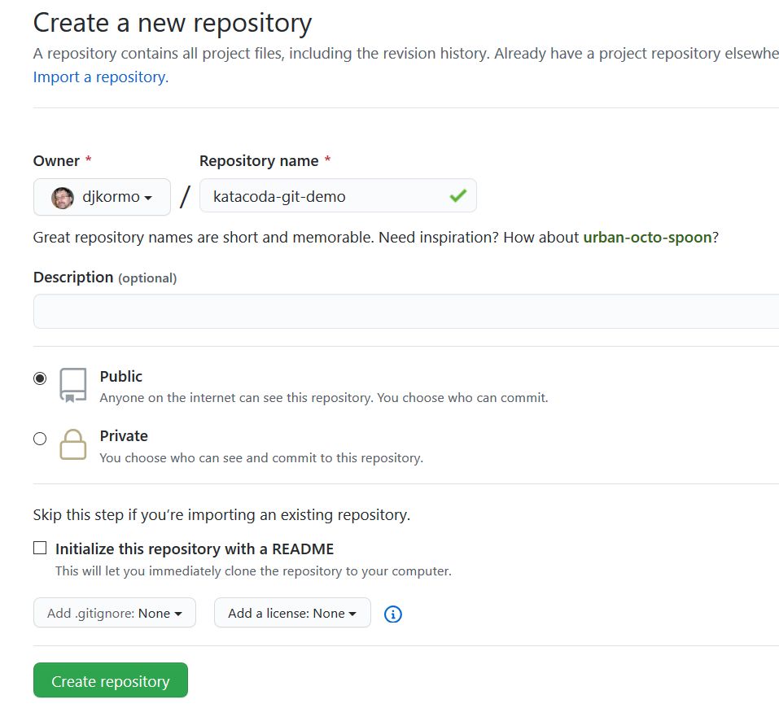
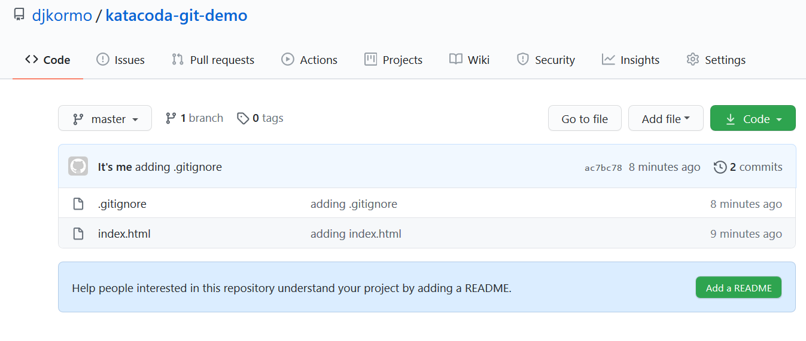

Praca ze zdalnym repozytorium


Na potrzeby ninejszego kursu wykorzystamy serwis hithub

Na początku utworzymy nowe repozytorium i połączymy je  z naszym lokalnym



W tym momencie mamy puste zdalne repozytorium i wypełnione repozytorium lokalne.

W naszym przykładzie adres zdalnego repozytorium wygląda tak

https://github.com/djkormo/katacoda-git-demo.git


Są dwa podejścia w zależności od tego jak budujemy naszą infrastrukturę

1) Tworzymy nowe i puste repozytorium lokalne
```bash
echo "# katacoda-git-demo" >> README.md
git init
git add README.md
git commit -m "first commit"
git remote add origin https://github.com/djkormo/katacoda-git-demo.git
git push -u origin master
```                

2) Wypychamy zmiany z lokalnego repozytorium do zdalnego 
```bash
git remote add origin https://github.com/djkormo/katacoda-git-demo.git
git push -u origin master
```

Druga opcją jest tą z której skorzystamy

Wpisz w linii komend

w zmiennej REMOTE_REPO zapisujemy  adres naszego zdalnego repozytorium na github

`export REMOTE_REPO=https://github.com/djkormo/katacoda-git-demo.git`{{copy}}

Dodajemy do naszego lokalnego repozytorium jego zdalną gałąź o nazwie origin

`git remote add origin $REMOTE_REPO`{{execute}}

Wypychamy zmiany, które mamy lokalnie do repozytorium zdalnego.

`git push -u origin master`{{execute}}

Podczas procesu musimy podać nazwę uzytkownika i hasło

<pre>
Username for 'https://github.com': djkormo
Password for 'https://djkormo@github.com':
Counting objects: 6, done.
Delta compression using up to 2 threads.
Compressing objects: 100% (3/3), done.
Writing objects: 100% (6/6), 504 bytes | 0 bytes/s, done.
Total 6 (delta 0), reused 0 (delta 0)
To https://github.com/djkormo/katacoda-git-demo.git
 * [new branch]      master -> master
Branch master set up to track remote branch master from origin.
</pre>

Nasze repozytorium zdalne teraz wygląda tak




Jeśli chcemy dowiedzieć się o adresie zdalengo repozytorium wystarczy uruchomić

`git remote -v`{{execute}}

<pre>
origin  https://github.com/djkormo/katacoda-git-demo.git (fetch)
origin  https://github.com/djkormo/katacoda-git-demo.git (push)
<pre>

## Git Remote

Remote repositories allow you to share changes from or to your repository. Remote locations are generally a build server, a team members machine or a centralised store such as Github.com. Remotes are added using the git remote command with a friendly name and the remote location, typically a HTTPS URL or a SSH connection for example https://github.com/OcelotUproar/ocelite.git or git@github.com:/OcelotUproar/ocelite.git.

The friendly name allows you to refer to the location in other commands. Your local repository can reference multiple different remote repositories depending on your scenario.

Task
This environment has a remote repository location of /s/remote-project/1. Using git remote, add this remote location with the name origin.

Protip

## Git Push
When you're ready to share your commits you need to push them to a remote repository via git push. A typical Git workflow would be to perform multiple small commits as you complete a task and push to a remote at relevant points, such as when the task is complete, to ensure synchronisation of the code within the team.

The git push command is followed by two parameters. The first parameter is the friendly name of the remote repository we defined in the first step. The second parameter is the name of the branch. By default all git repositories have a master branch where the code is worked on.

Task
Push the commits in the master branch to the origin remote.


# Git Pull
Where git push allows you to push your changes to a remote repository, git pull works in the reverse fashion. git pull allows you to sync changes from a remote repository into your local version.

The changes from the remote repository are automatically merge into the branch you're currently working on.

Task
Pull the changes from the remote into your master branch.

In the next step we'll explore what changes have been made.


## Git Log
As described in the previous scenario you can use the git log command to see the history of the repository. The git show command will allow you to view the changes made in each commit.

In this example, the output from git log shows a new commit by "DifferentUser@JoinScrapbook.com" with the message "Fix for Bug #1234". The output of git show highlights the new lines added to the file in green.

Protip
Use the command git log --grep="#1234" to find all the commits containing #1234

## Git Fetch

The command git pull is a combination of two different commands, git fetch and git merge. Fetch downloads the changes from the remote repository into a separate branch named remotes/<remote-name>/<remote-branch-name>. The branch can be accessed using git checkout.

Using git fetch is a great way to review the changes without affecting your current branch. The naming format of branches is flexible enough that you can have multiple remotes and branches with the same name and easily switch between them.

The following command will merge the fetched changes into master.

git merge remotes/<remote-name>/<remote-branch-name> master
We'll cover merging in more detail in a future scenario.

Task
Additional changes have been made in the origin repository. Use git fetch to download the changes and then checkout the branch to view them.

Protip
You can view a list of all the remote branches using the command git branch -r
