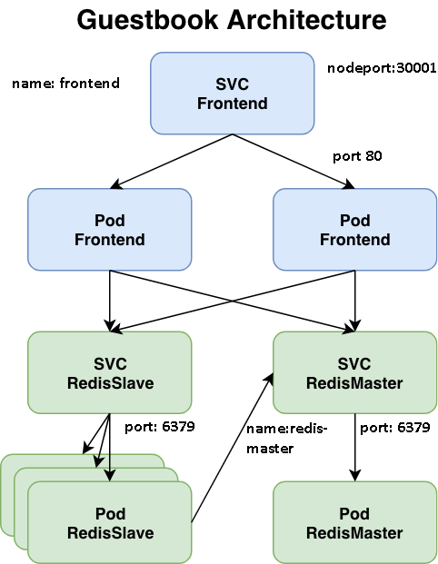

**Troubleshooting exercises**

Show list of cluster nodes

`kubectl get nodes`{{execute HOST1}}

Here we have cluster with 1.18 version

Show all namespaces

`kubectl get ns`{{execute}}

List all of objects in default namespace

`kubectl get all -o wide`{{execute}}

Inspect objects deployed in alpha namespace

`kubectl get all,ep -n alpha`{{execute}}

**Try to fix kubernetes objects to see application in Application tab on 30001 port.**

CHECK
`kubectl get svc frontend -n alpha -o yaml |grep "nodePort: 30001" &&  echo "done"`{{execute}}
CHECK