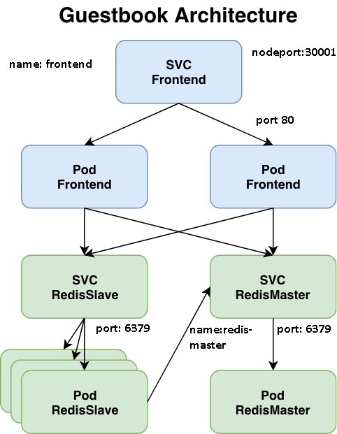
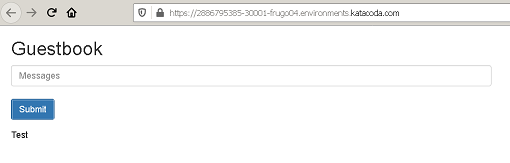

# Troubleshooting exercises

Wait until pods in beta namespace are deployed

click ```clear```{{execute interrupt}} to begin

Show all namespaces

`kubectl get ns`{{execute}}



Inspect objects deployed in beta namespace

`kubectl get all,ep -n beta`{{execute}}


**Try to fix kubernetes objects to see application in Application tab on 30001 port.**



CHECK
`kubectl get svc frontend -n beta -o yaml |grep "nodePort: 30001" && kubectl get svc frontend -n beta -o yaml |grep "targetPort: 80" && echo "done" `{{execute}}
CHECK


**To move to the next step make sure to have all checks with "done"**
