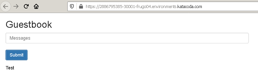

**Troubleshooting exercises**

Show all namespaces

`kubectl get ns`{{execute}}

Inspect objects deployed in delta namespace

`kubectl get all,ep -n delta`{{execute}}

**Try to fix kubernetes objects to see application in Application tab on 30001 port.**

CHECK
`kubectl get svc frontend -n delta -o yaml |grep "nodePort: 30001" && kubectl get svc frontend -n delta -o yaml |grep "targetPort: 80" && echo "done" `{{execute}}
CHECK