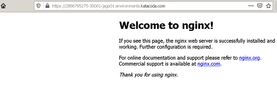

# Troubleshooting exercises 

Show all namespaces

`kubectl get ns`{{execute}}

Show nodes 
`kubectl get nodes`{{execute}}

Inspect objects deployed in kappa namespace

`kubectl get all,ep -n kappa`{{execute}}

Try to scale nginx-deployment deployment to 6  replicas

**Hint!**
Look at pods in kube-system namespace, Look at status of the nodes

**Try to fix kubernetes objects to see application in Application tab on 30001 port.**

CHECK
`kubectl get svc nginx -n kappa -o yaml |grep "nodePort: 30001" && kubectl get svc nginx -n kappa -o yaml |grep "targetPort: 80" && echo "done" `{{execute}}

`kubectl get deploy nginx-deployment -n kappa -o yaml | grep "replicas: 6" && echo "done"`{{execute}}

`kubectl get pod -n kappa | grep nginx-deployment | grep Running && echo "done"`{{execute}}

CHECK

**To move to the next step make sure to have all checks with "done"**
